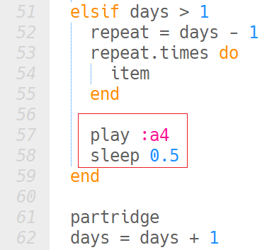

## Step by step song

+ At the bottom of your code, underneath your functions, remove any calls to the functions you may have left over from when you tested them.

+ Create a variable called `days` and set its value to 1

```ruby
days = 1
```

+ Next, create a loop that runs 12 times, once for each verse of the song.

```ruby
12.times do

end
```

Now let's start building up the song. Instead of calling each function over and over, making a very long program, we can use some logic to decide which parts to play and how many times to repeat each one.

+ We already know that the introduction and the _partridge in a pear tree_ happen in every verse, so add a call to your `intro` and `partridge` functions inside the loop.

```ruby
12.times do
    intro
    partridge
end
```

Now let's think about the other days, starting with the 12th day.

+ Days 12 - 6 have the same melody which is the one inside our `item` function.
+ Day 5 has a special melody - the `five_gold_rings`
+ Days 4 - 2 have the same melody as `item` if we hear them as part of a verse number which is less than 5, but they have the special `four_three_two` melody if they happen after `five_gold_rings`.

+ Add some code between the `intro` and the `partridge` to test whether the number of days is five or above:

```ruby
12.times do
    intro
    if days >= 5

    end
    partridge
end
```

If it is, you need to play the `item` melody the correct number of times. If it is day 12, for example, this will be 7 times (for days 12, 11, 10, 9, 8, 7 and 6). You can work out the correct number of times to repeat by taking the number of days minus 5, because the last 5 days are handled differently.

+ Add some code to work out how many times to play the `item` melody, then repeat it that many times:

```ruby
if days >= 5
    repeat = days - 5
    repeat.times do
      item
    end
end
```

+ Immediately after the code finishes repeating `item`, add the code to play the `five_gold_rings` and the special `four_three_two` melody.

+ Run your code. You will hear the intro and the partridge, but no items. This is because the `days` variable equals 1. Change the value of the variable to a number between 12 and 5 and check that you hear the right melody for the day you selected.

+ Once you are finished testing, change the days variable back to 1.

Now you just need to handle days 4 - 2.

+ Underneath the `four_three_two` line, add an `elsif` to handle these days. The code has already decided that `days` is less than 5 (otherwise this check wouldn't be happening) so you only need to check whether `days` is greater than 1 to be sure to capture days 4 - 2.

```ruby
elsif days > 1

```

+ This time, you want the `item` melody to repeat in the same way as it did for days 12-5. You can calculate how many times you want it to repeat by taking the number of `days` minus one (because we don't need to play it for the partridge day).

```ruby
elsif days > 1
    repeat = days - 1
    repeat.times do
        item
    end
```

+ Finally, locate your cursor after the `partridge` function - this is the end of the verse. Add one to the `days` variable so that we hear the verse for every day.

```ruby
days = days + 1
```

+ Run your code and check that you hear the right song.

You might notice that the song gets a little out of sync - there is supposed to be a brief pause between verses. You can rectify this by adding in a sleep command to create a brief pause at the end of your functions.

+ Add this code at the end of your `intro` function to pause for half a beat:

```ruby
sleep 0.5
```

+ Play the song again and listen for the brief pause between the end of the introduction melody and the partridge melody.

+ Add a pause to the end of the `partridge` and `five_gold_rings` functions. Experiment with different pause lengths (0.5, 1, 2 etc.) until you find the one that sounds right.

You may also have noticed that we didn't yet add the note to represent "and" which comes in from verse two onwards when we need to say "_**and**_ a partridge in a pear tree".

+ Add some code to play a single note for half a beat (0.5) if we are on any number of days that is greater than 1:



+ Run your code again and check that the song plays correctly
